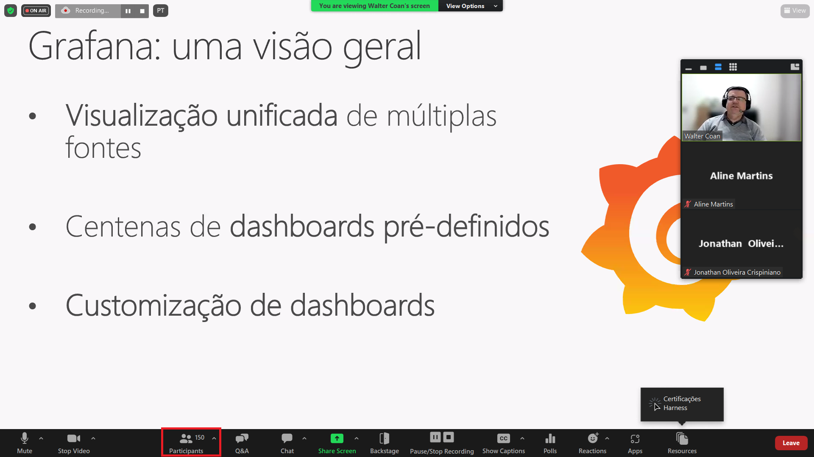
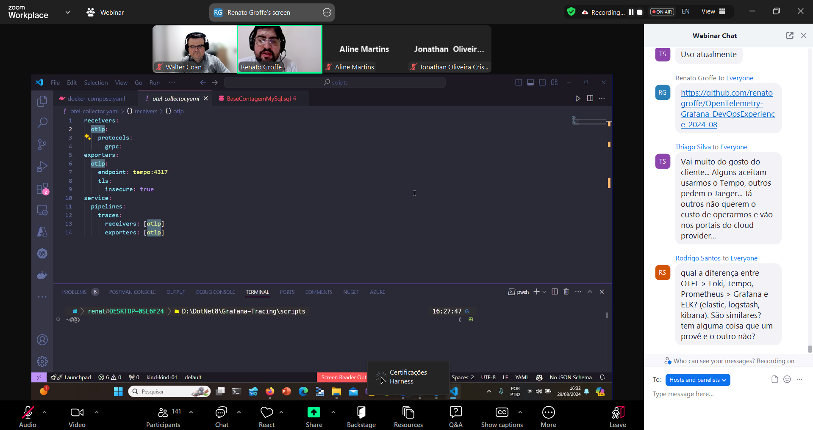
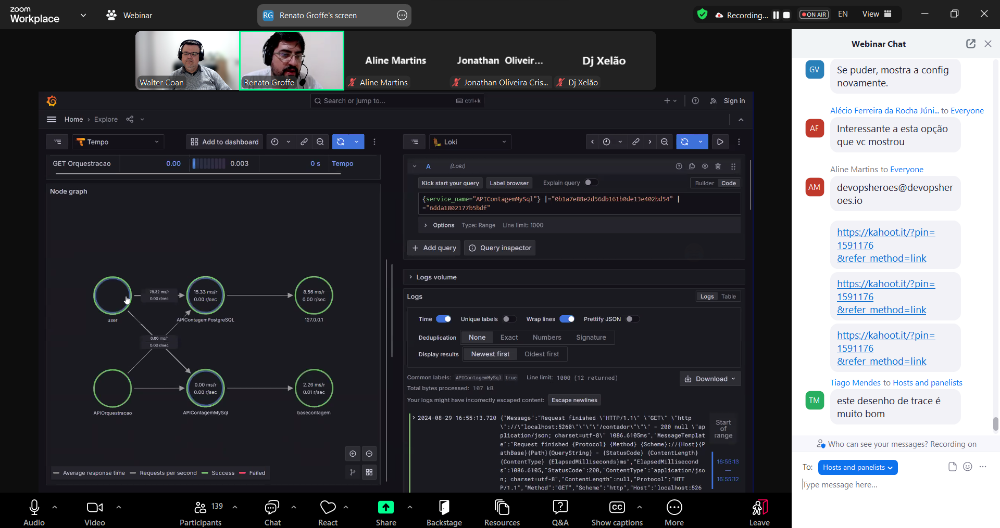
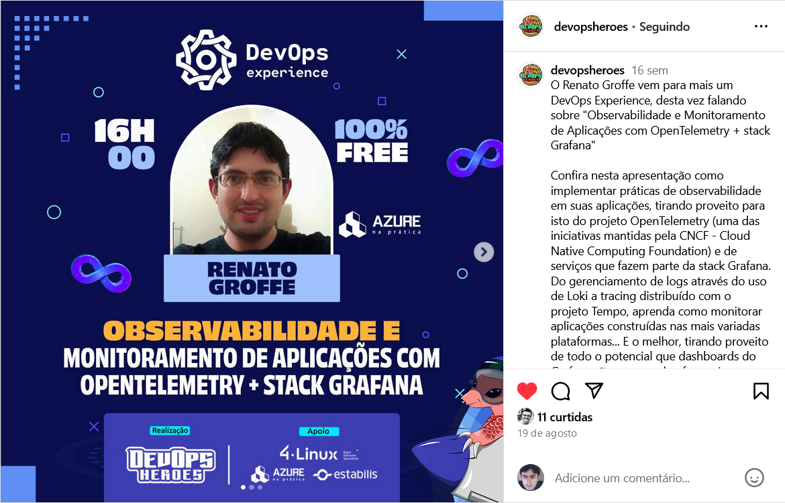
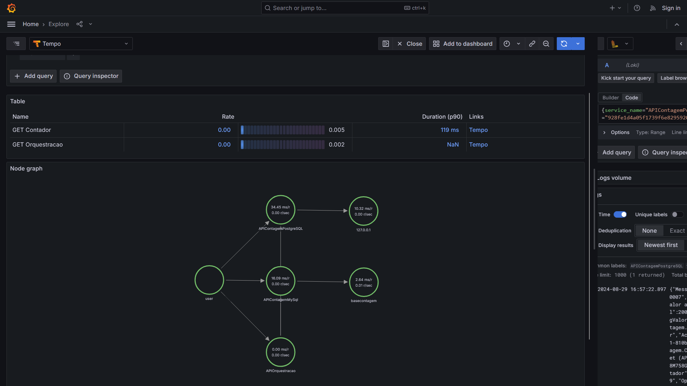
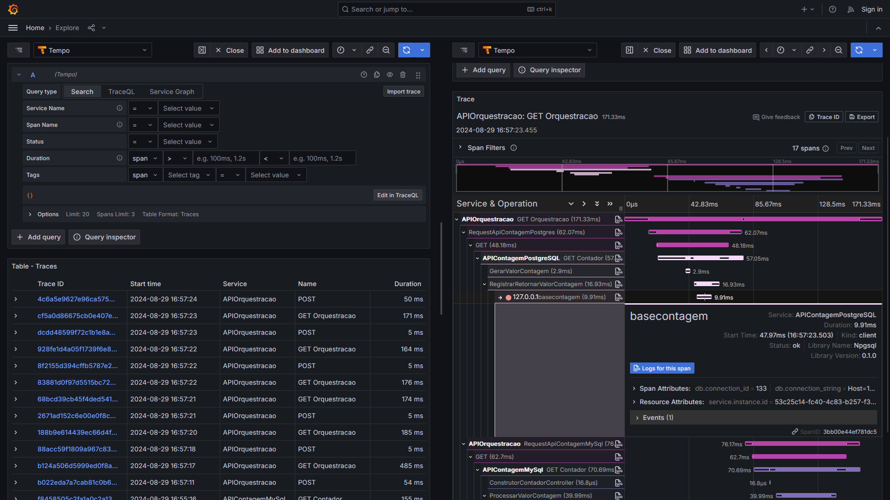

# OpenTelemetry-Grafana_DevOpsExperience-2024-08
Conteúdos sobre OpenTelemetry + Grafana de apresentação realizada durante a edição de Agosto-2024 do DevOps Experience.

Título da apresentação: **Observabilidade e Monitoramento de Aplicações com OpenTelemetry + stack Grafana**

Data: **29/08/2024 (quinta-feira)**

Tipo do evento: **Online**

Ferramenta de transmissão: **Zoom**

Tecnologias utilizadas: **Grafana, OpenTelemetry, Docker, Docker Compose, Linux, Grafana Tempo, Loki, Prometheus, PostgreSQL, MySQL, .NET, ASP.NET Core**

Número de participantes: **150 pessoas (pico de audiência ao longo da live)**

Link do evento: [**Instagram**](https://www.instagram.com/p/C-3hOSwJmDI/?img_index=1)

Esta palestra foi realizada em conjunto com meu amigo **Walter Coan (Microsoft MVP)**.

Deixo aqui meus agradecimentos ao **Daniel Ginês** e à **Aline Martins** por todo o apoio para que eu partipasse como palestrante de mais uma edição do **DevOps Experience**.

Outros prints podem ser encontrados neste [**diretório**](/img/).

---

## Aplicação demonstrada na palestra

Exemplo utilizando **Grafana**, **Loki** e **Tempo**:

